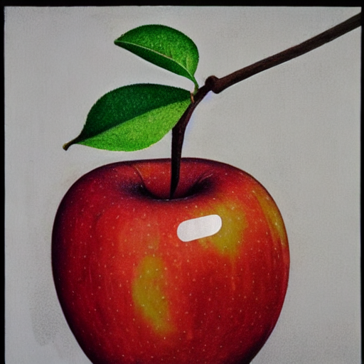
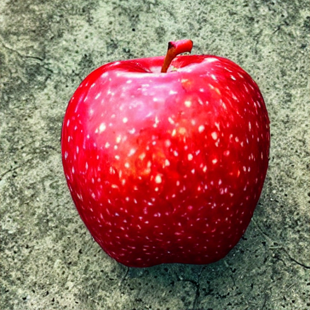
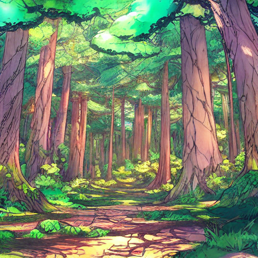
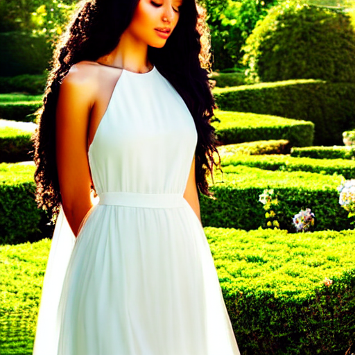
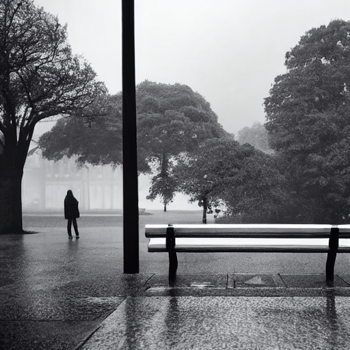
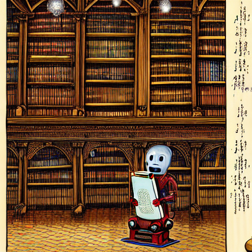
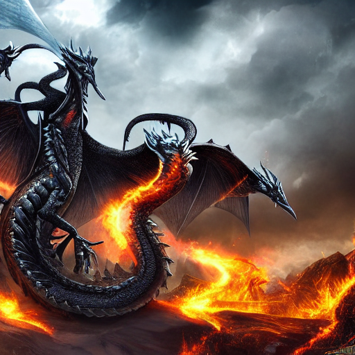

# 🎨 프롬프트 엔지니어링 워크숍 포트폴리오

> Stable Diffusion AI를 활용한 이미지 생성 실습 결과물

## 👤 수강생 정보

| 항목 | 내용 |
|------|------|
| **이름** | 김진수 |
| **학번** | 12165055 |
| **작성일** | 2026년 01월 23일 |
| **총 작품 수** | 9개 |

---

## 📚 회차별 학습 기록

### 📖 2회차: Zero-shot vs Detail

**학습 기법**: 상세 프롬프팅

#### 작품 1

| 항목 | 내용 |
|------|------|
| **프롬프트** | `an apple` |
| **네거티브** | `-` |
| **생성 시간** | 2026-01-23 05:46:53 |

#### 작품 2

| 항목 | 내용 |
|------|------|
| **프롬프트** | `A hyper-realistic red apple placed at the center of the image,
perfectly round shape with subtle natural asymmetry,
glossy yet slightly matte skin texture, visible tiny pores and natural speckles,
deep crimson red color with gentle yellow and green undertones near the stem,
a short brown stem with realistic wood texture,
soft natural light coming from the left side, creating smooth highlights and soft shadows,
shallow depth of field, background softly blurred (bokeh),
ultra-high resolution, macro photography style,
photorealistic, cinematic lighting, studio quality, 8K detail` |
| **네거티브** | `-` |
| **생성 시간** | 2026-01-23 05:46:53 |

#### 작품 3

| 항목 | 내용 |
|------|------|
| **프롬프트** | `an apple` |
| **네거티브** | `-` |
| **생성 시간** | 2026-01-23 05:48:42 |

> 제로 샷은 단순하고 맞지 않는 이미지가 나올 수 있으나 제로샷을 통하여 더 디테일한 이미지를 생성할 수 있음

#### 작품 4

| 항목 | 내용 |
|------|------|
| **프롬프트** | `A hyper-realistic red apple placed at the center of the image,
perfectly round shape with subtle natural asymmetry,
glossy yet slightly matte skin texture, visible tiny pores and natural speckles,
deep crimson red color with gentle yellow and green undertones near the stem,
a short brown stem with realistic wood texture,
soft natural light coming from the left side, creating smooth highlights and soft shadows,
shallow depth of field, background softly blurred (bokeh),
ultra-high resolution, macro photography style,
photorealistic, cinematic lighting, studio quality, 8K detail` |
| **네거티브** | `-` |
| **생성 시간** | 2026-01-23 05:48:42 |

> 제로 샷은 단순하고 맞지 않는 이미지가 나올 수 있으나 제로샷을 통하여 더 디테일한 이미지를 생성할 수 있음

---

### 📖 3회차: Persona & Style

**학습 기법**: 스타일 프롬프팅

#### 작품 1

| 항목 | 내용 |
|------|------|
| **프롬프트** | `a forest, anime style, cel shaded, vibrant colors, detailed, dramatic lighting, strong shadows, cinematic, wide shot, panoramic view` |
| **네거티브** | `-` |
| **생성 시간** | 2026-01-23 05:54:12 |

---

### 📖 4회차: Negative Prompting

**학습 기법**: 네거티브 프롬프팅

#### 작품 1

| 항목 | 내용 |
|------|------|
| **프롬프트** | `a beautiful portrait of a young woman, elegant dress, garden background, soft lighting` |
| **네거티브** | `bad hands, extra fingers, mutated hands, poorly drawn face, mutation, deformed, ugly` |
| **생성 시간** | 2026-01-23 06:19:27 |

> 네거티브 프롬프트에 따라, GS에 따라 이미지 생성에 차이가 생긴다

---

### 📖 5회차: Step-back Prompting

**학습 기법**: 추상화 프롬프팅

#### 작품 1

| 항목 | 내용 |
|------|------|
| **프롬프트** | `a person sitting alone on an empty bench, rainy day, view from behind, grey cloudy sky, melancholic atmosphere` |
| **네거티브** | `blurry, low quality, distorted, text, watermark` |
| **생성 시간** | 2026-01-23 06:28:27 |

---

### 📖 6회차: Chain of Thought

**학습 기법**: 레이어 빌딩

#### 작품 1

| 항목 | 내용 |
|------|------|
| **프롬프트** | `a robot, reading a book, in an ancient library, warm candelight, dust particles floating in air, oil painting style, renaissance aesthetic, highly detailed` |
| **네거티브** | `blurry, low quality` |
| **생성 시간** | 2026-01-23 06:34:55 |

> 레이어를 쌓아 프롬프트를 설계하면 더욱 디테일한 이미지 생성 가능

---

### 📖 7회차: 종합 실습

**학습 기법**: 종합

#### 작품 1

| 항목 | 내용 |
|------|------|
| **프롬프트** | `masterpiece, best quality, very aesthetic, newest,
dragon, black dragon, dragon wings,
fireball, dragon looking at viewer
fantasy background, castle background,, highly detailed, sharp focus, 8k resolution` |
| **네거티브** | `blurry, low quality, distorted, ugly, bad anatomy, out of frame,` |
| **생성 시간** | 2026-01-23 06:40:15 |

> 종합적으로 temperature, 퓨샷, 제로샷, 스텝 백, 레이어를 이용해서 이미지를 생성하면 상황에 따라 가장 괜찮은이미지를 만들 수 있다.

---

## 🏆 Best 작품

**선택한 작품**: 

**선택 이유**: 

---

## 💡 워크숍 후기

---

## 🛠️ 사용 기술

- Stable Diffusion
- Streamlit
- Google Colab + ngrok

---

<i>🎓 KNU 프롬프트 엔지니어링 워크숍 수료</i>

